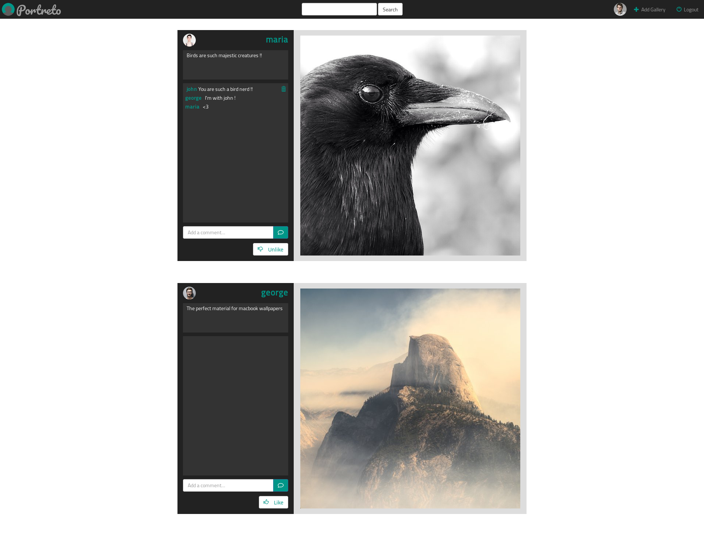
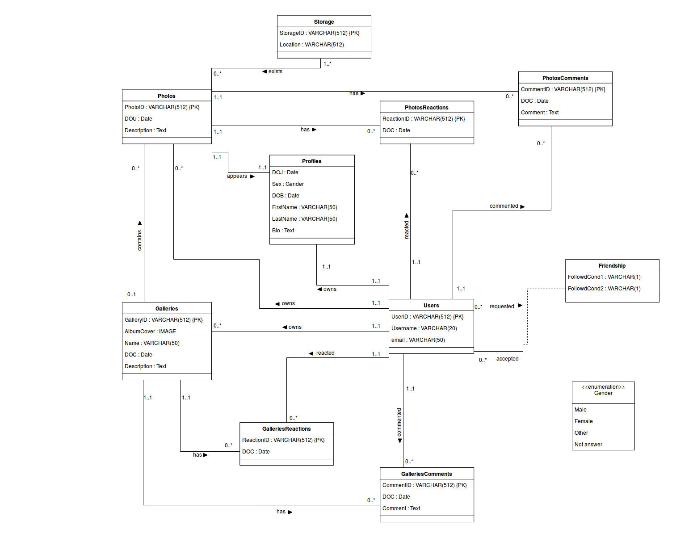
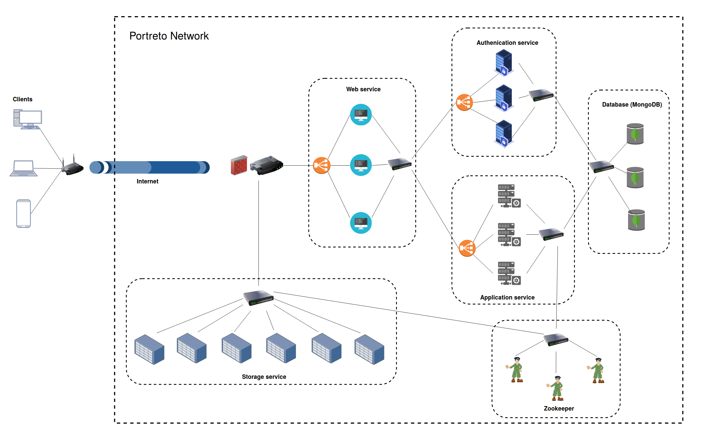
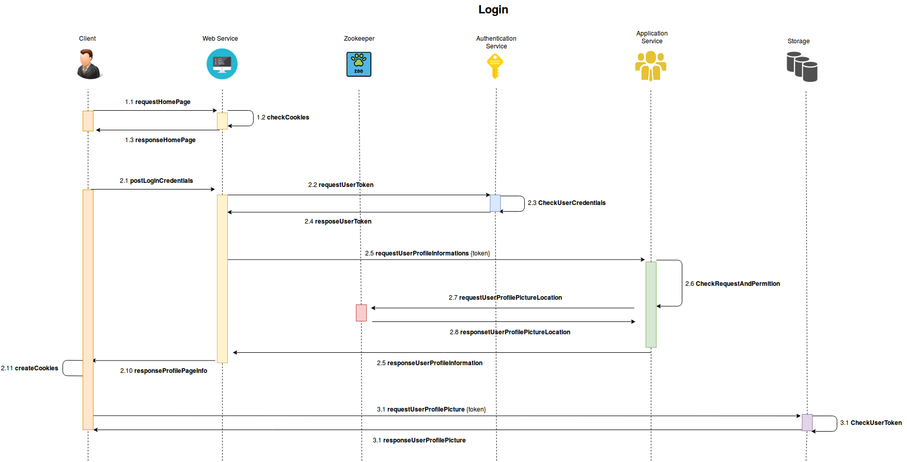

# Portreto  

Portreto is a distributed image-oriented web application which is implemented in [multitier architecture](https://en.wikipedia.org/wiki/Multitier_architecture).

## Screenshots

One of the most important goals of this project is to build a distributed application which does not have a [single point of failure](https://en.wikipedia.org/wiki/Single_point_of_failure). In order to do this, we had to design stateless [microservices](https://en.wikipedia.org/wiki/Microservices) runing in [docker](https://www.docker.com/) [containers](https://www.docker.com/resources/what-container). Μicroservices are written in [python 3.7](https://www.python.org/downloads/release/python-370/) using [django](https://www.djangoproject.com/) framework. Moreover, we use [docker swarm](https://docs.docker.com/engine/swarm/) to replicate and load balance most of them.

The actual distinctly microservices we used are:
* [Web service](./portreto/web_app/) (presentation layer)
* [Authentication service](./portreto/auth) (provides valid authentication tokens in order to work stateless)
* [Application service](./portreto/application) (logic tier)
* [Storage service](./portreto/storage) (holds users’ photos)
* [Database](./portreto/mongo-rs0-1) (users’ information exist here. E.g. usernames, emails, etc..)
* [Zookeeper]() 

## Microservices

### Web service
Portreto's web interface is built using [bootstap](https://getbootstrap.com/) framework. Web service's job is to receive requests from clients, communicate using [RESTful APIs](https://en.wikipedia.org/wiki/Representational_state_transfer) with authentication and/or application services and finally render responses to send back to clients. As we already mentioned above, web service is a collection of replicated containers (we have used three of them). Last but not least, web service creates and retrieves cookies in client-side, where we store authentication tokens.

### Authentication service
Authentication service communicates with web service in order to provide authentication tokens to clients. We use [JWT](https://jwt.io/) standard to have a secure and trust communication between clients and portreto. Authentication service is also a collection of three containers.

### Application Service
Application service is the brain of portreto. Each client request is computed here. Web service sends requests to application service using RESTful API based on clients input. Then, the services job is to receive these requests, check the provided authentication token that exists on each request header for user identification and authorization, communicate with database to retrieve needed information, communicate with zookeeper to find out available storage services for requested photos and provide response information back to web. Application service is also a collection of three containers.

### Storage service
Storage service is one of the most important parts of this application. Each user has photos, each photo is stored in two different storage services when it is uploaded by the user. Clients could access photos directly using url that application service has provide to them. We use six different containers for storage service.

#### Metrics:
A modified version of django-statsy is used to view get/post/delete metrics on the storage services

### Database
A distributed replicaset of [MongoDB](https://www.mongodb.com/) has been used in this project in order store users informations.

#### Database schema for application service

## Portreto network 

## Dataflow
This is login's sequence diagram

## Fault tolerance
The system has been succesfully tested in docker-swarm mode for correct replication of microservices and lack of a single-point failiure 